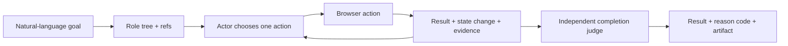

# GAIA Agentic QA

GAIA turns a natural-language web QA goal into a sequence of role/ref browser
actions, records what actually happened, and asks an independent judge to
verify the final state from evidence instead of trusting the actor's claim.

This repository is the portfolio and open-source edition of a 2025-2026
capstone project. Presentation-only assets, local browser profiles, generated
artifacts, and the full third-party source tree were intentionally left out.

## Why it exists

Traditional browser tests are reliable when selectors and flows are stable,
but expensive to maintain across frequently changing interfaces. Pure LLM
agents adapt better, yet can claim success without enough proof. GAIA focuses
on the gap between those approaches:

- semantic role/ref actions instead of invented CSS selectors;
- a multi-call context ledger across actor, action, recovery, and judge calls;
- explicit failure reasons such as stale ref, pointer interception, or block;
- independent completion verification from current DOM and state changes;
- reproducible benchmark artifacts with latency and recovery metrics.

## Runtime flow



## Quick start

Requirements: Python 3.10+, Node.js 20+, npm, and Chrome/Chromium.

```bash
git clone https://github.com/coldmans/gaia-agentic-qa.git
cd gaia-agentic-qa
python -m venv .venv
source .venv/bin/activate
pip install -e ".[gui]"
gaia auth login --provider openai --method oauth
gaia chat --gui --url https://example.com
```

OpenAI authentication reuses the local Codex OAuth session by default. A
manually supplied API key is an explicit fallback, not the primary setup path.
GAIA only asks `codex login status` and delegates calls to Codex; it never reads
or copies Codex access/refresh tokens. See
[`docs/architecture/AUTHENTICATION.md`](docs/architecture/AUTHENTICATION.md).

The packaged browser adapter installs its pinned npm dependencies on first
run. Runtime state and browser profiles live under `~/.gaia/runtime`, outside
the repository.

## Install only what you use

```bash
pip install -e .                 # CLI and browser runtime
pip install -e ".[gui]"         # desktop application
pip install -e ".[gemini]"      # Gemini provider
pip install -e ".[planner]"     # PDF/spec ingestion
pip install -e ".[telegram]"    # optional remote control
pip install -e ".[all,dev]"     # full development environment
```

The base package includes Playwright because role/ref snapshots are core to
GAIA. PySide6, FastAPI, PDF tooling, and Telegram support remain opt-in so the
default install does not pull every integration.

## Benchmarking

```bash
python scripts/run_goal_benchmark.py \
  --suite gaia/tests/scenarios/hacker_news_public_suite.json \
  --provider openai \
  --model gpt-5.6-sol
```

The benchmark output separates total duration, actor LLM time, judge LLM time,
WAIT/inspect decisions, recovery events, and blocked user actions. See
[`docs/benchmarks/METHODOLOGY.md`](docs/benchmarks/METHODOLOGY.md).

The preserved capstone baseline was 30/30 successful scenarios with 76.5s
average duration under a warm-process/cold-state policy. It is a defined-suite
result, not a claim about every website.

The 2026-07-16 public-manifest regression used GPT-5.6 Sol and produced 26
SUCCESS, 4 deterministic external/time-dependent blockers, and 0 non-blocked
agent failures. Mean duration was 66.45s. The four blocked scenarios reproduced
the same conditions on a focused rerun; see
[`docs/benchmarks/2026-07-16-gpt-5.6-sol-portfolio-30.md`](docs/benchmarks/2026-07-16-gpt-5.6-sol-portfolio-30.md).

A scoped Hacker News A/B check (two successful runs per variant) reduced the
actor prompt from 77,520 to 48,304 characters (-37.7%). Mean actor LLM latency
fell from 15.82s to 13.37s (-15.5%), while end-to-end duration changed from
27.52s to 26.84s. This is a narrow optimization gate, not a general benchmark;
see [`docs/benchmarks/2026-07-16-prompt-compaction.md`](docs/benchmarks/2026-07-16-prompt-compaction.md).

## Project layout

```text
gaia/                         Python runtime, GUI, harness, and tests
gaia/_runtime/openclaw/       pinned browser adapter bundle and license
gaia-battle-web/              Next.js/Supabase live comparison board
scripts/                      benchmark and maintenance entrypoints
skills/gaia/                  installable Codex skill instructions
docs/architecture/            runtime design and ownership boundaries
docs/portfolio/               project case study and failure stories
```

## What to inspect first

- `gaia/src/phase4/goal_driven/agent.py`: execution loop
- `gaia/src/phase4/goal_driven/llm_decision_runtime.py`: actor prompt and timing
- `gaia/src/phase4/goal_driven/goal_completion_helpers.py`: independent judge
- `gaia/src/phase4/mcp_openclaw_dispatch_runtime.py`: ref action and recovery
- `scripts/run_goal_benchmark.py`: reproducible evaluation and trace metrics

## Portfolio

The detailed problem, architecture, debugging stories, failures, and lessons
are in [`docs/portfolio/GAIA_PORTFOLIO_CASE_STUDY.md`](docs/portfolio/GAIA_PORTFOLIO_CASE_STUDY.md).
The responsive portfolio page is served from `/portfolio` by the included
Next.js app.

Live portfolio: <https://gaia-agentic-qa.vercel.app/portfolio>

## Safety boundary

CAPTCHA, OTP, account approval, and other human-only gates are reported as
blocked user actions. GAIA does not attempt to bypass them. Credentials,
browser profiles, raw screenshots, and benchmark artifacts are ignored by Git.

## License

GAIA is available under the MIT License. Third-party runtime attribution is in
[`THIRD_PARTY_NOTICES.md`](THIRD_PARTY_NOTICES.md).
